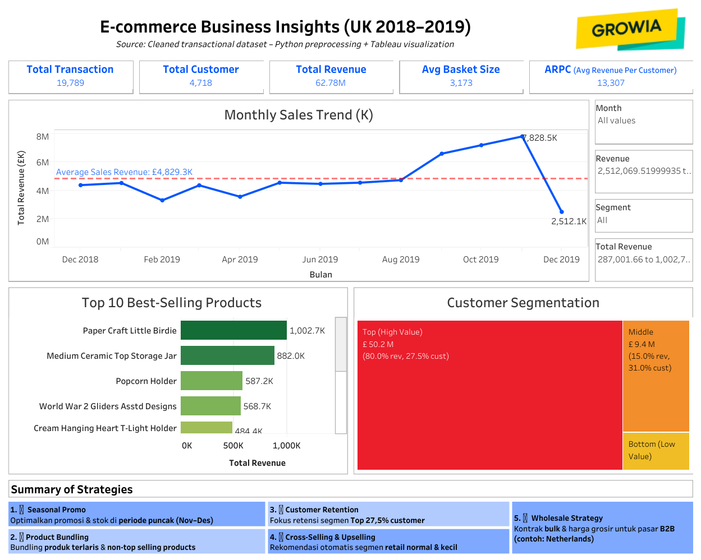

# UK E-Commerce Analysis (Intermediate Certification Project)

Analisis data transaksi e-commerce UK untuk menemukan pola pembelian, memahami retensi pelanggan, serta menjawab pertanyaan kritis bisnis.  
Proyek ini merupakan bagian dari **Intermediate Data Analyst Certification**.  

---

📌 **Fitur utama**:  

- ⭐ **Top Contributing Products**  
  Analisis kontribusi produk terhadap penjualan melalui segmentasi berdasarkan volume transaksi dan total revenue.  

- 🔁 **Retention Cohort Analysis**  
  Mengidentifikasi tren retensi pelanggan dari waktu ke waktu untuk memahami pola loyalitas.  

- 📈 **Time Series Analysis**  
  Menganalisis tren penjualan dan pola musiman (seasonality) berdasarkan periode waktu.  

- 💸 **Price Elasticity**  
  Menilai sensitivitas permintaan terhadap perubahan harga untuk memahami dampak strategi harga.  

- 🧺 **Market Basket Size Analysis**  
  Membandingkan basket size antar negara untuk membedakan pola transaksi retail (kecil) dan grosir (besar).  

- ❓ **Pertanyaan Kritis & Insight Bisnis**  
  Menjawab pertanyaan utama: tren penjualan, produk terlaris, pola pembelian per transaksi, pelanggan paling bernilai, serta rekomendasi strategi bisnis.  

- 📊 **Visualisasi Interaktif (Tableau Dashboard)**  
  Dashboard interaktif untuk eksplorasi data dan presentasi insight.  

---

🖼️ **Preview (Tableau Dashboard)**  

---

🔗 **Repo utama:** [UK E-Commerce Analysis](https://github.com/hfz1988/uk-ecommerce-analysis)
