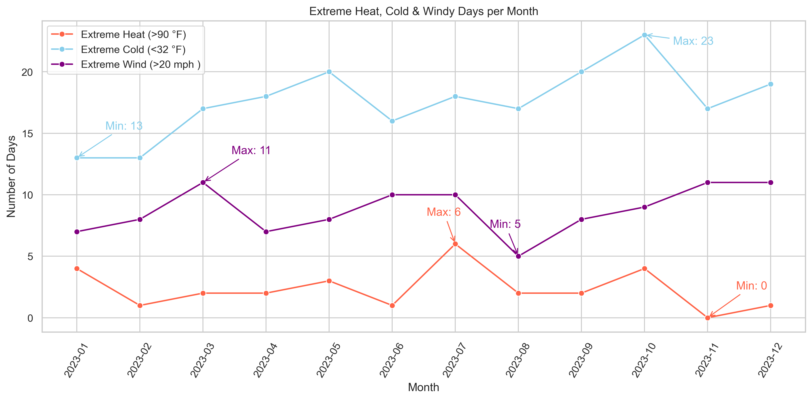

# Weather Data Analysis (Learning Project)

Proyek eksplorasi data cuaca untuk melatih kemampuan SQL query dan visualisasi data menggunakan Python.  
Project ini dibuat sebagai latihan tambahan di luar sertifikasi resmi.  

---

📌 **Fitur utama**:  
- 🔍 SQL Query Practice (select, group by, filtering, aggregation)  
- 📊 Data Visualization dengan Python (matplotlib & seaborn)  
- 🌦️ Analisis tren cuaca sederhana (suhu, kecepatan angin, cuaca ekstrem)  

---

🖼️ **Preview (Extreme Heat, Cold & Windy Days)**  
  
📊 **Insight Interpretasi Chart dan Pemanfaatan data lanjutan**  
Visualisasi ini menunjukkan:
1. **Hari dingin ekstrem** (<32 °F) lebih sering terjadi dibanding hari panas ekstrem (>90 °F) dan hari berangin ekstrem (>20 mph).
2. Jumlah **hari dingin ekstrem** meningkat tajam di akhir tahun (Oktober–Desember), dengan puncak pada November.
3. **Hari panas ekstrem** hanya muncul di musim panas (Juli–Agustus) dengan jumlah yang relatif sedikit (≤ 6 hari/bulan).
4. Kondisi **angin ekstrem** menjadi bagian integral dari iklim ini, terutama di awal musim semi (Maret) dan di musim dingin (Desember), menunjukkan adanya perbedaan suhu yang signifikan antar massa udara.
5. Pola-pola ini secara keseluruhan menggambarkan wilayah dengan **iklim empat musim**, di mana musim dingin lebih dominan dan ekstrem dibandingkan musim panas.

💡 **Potensi Pemanfaatan Data Lanjutan**
1. **Perencanaan Energi**: Data ini sangat vital untuk perusahaan listrik dalam memprediksi permintaan energi (misalnya, untuk pemanas dan pendingin udara). Dengan begitu, mereka dapat merencanakan pasokan dan distribusi energi secara efisien, menghindari pemadaman listrik, dan mengelola biaya operasional.
2. **Industri Ritel**: Industri ritel musiman dapat menggunakan insight ini untuk mengelola inventaris. Mengetahui kapan hari ekstrem akan terjadi memungkinkan mereka menyesuaikan stok produk musiman, seperti jaket atau kipas angin, pada waktu yang tepat untuk memaksimalkan penjualan.
3. **Peringatan Dini**: Otoritas lokal dapat memanfaatkan data hari berangin ekstrem untuk mengeluarkan peringatan dini terkait potensi bahaya, seperti pohon tumbang, kerusakan properti, atau gangguan transportasi.
4. **Perencanaan Infrastruktur**: Industri konstruksi atau infrastruktur energi (jaringan listrik) dapat menggunakan data ini untuk merencanakan ketahanan terhadap kondisi angin ekstrem.
5. **Aktivitas Luar Ruangan**: Sektor pariwisata atau penyelenggara acara bisa menggunakan data ini untuk merencanakan kegiatan yang bergantung pada cuaca, seperti olahraga air atau festival luar ruangan.
---

🔗 **Repo utama:** [Weather Data Analysis](https://github.com/hfz1988/weather-analysis)
